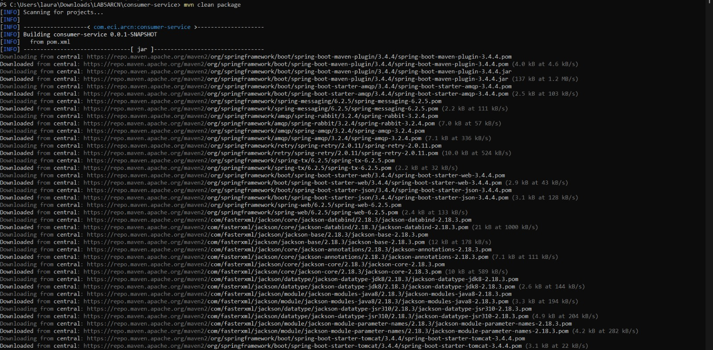
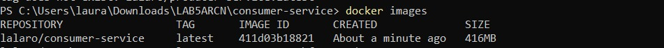
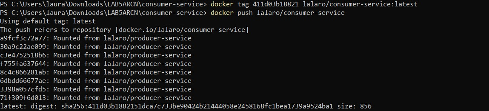
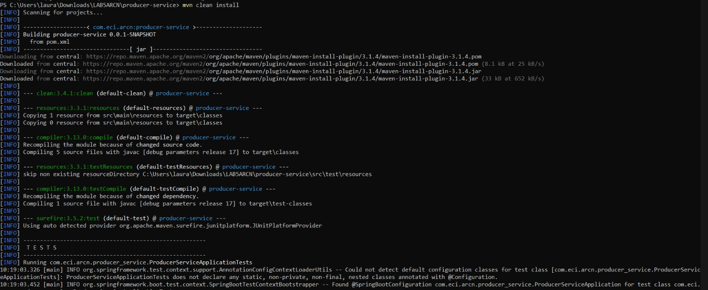
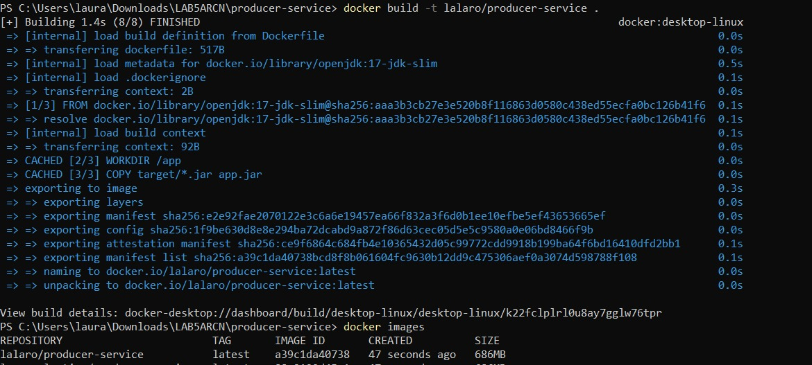
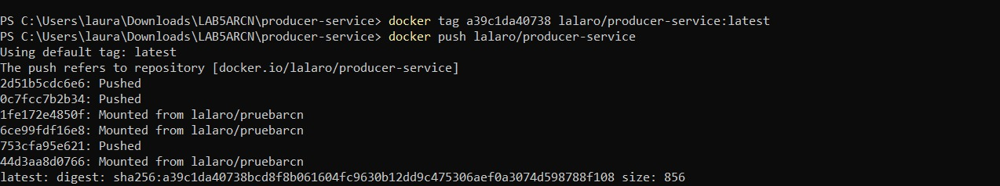
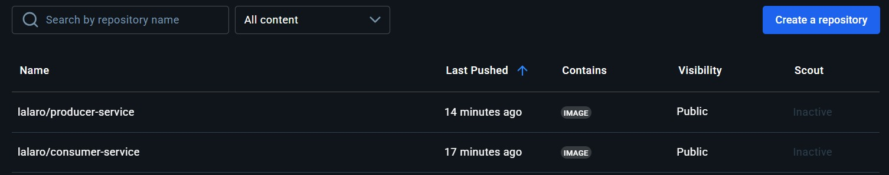
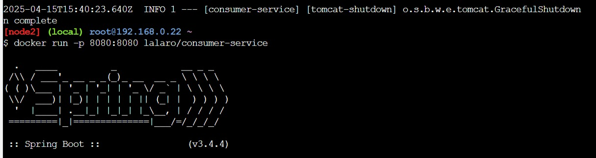
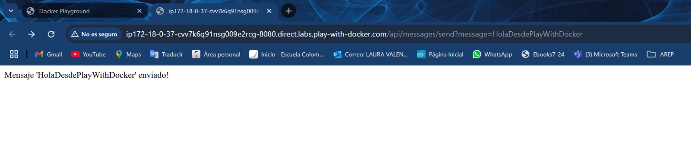

# Event-Driven Architecture Lab

Este laboratorio está diseñado para comprender y aplicar los principios de una arquitectura orientada a eventos usando tecnologías modernas como Spring Boot, WebSocket y JavaScript (React o vanilla JS).

📚 **Guía oficial del laboratorio**:  
https://eci-arcn.github.io/Labs/event-driven-lab/

---

## 🧱 Estructura del proyecto

Este proyecto se divide en:

- `backend/`  
  Contiene un servidor Spring Boot que expone una API REST y publica eventos en tiempo real usando WebSocket.

- `frontend/`  
  Implementación en JavaScript puro o React que consume la API REST y recibe eventos por WebSocket.

---

## 🚀 Tecnologías usadas

- Java 17+
- Spring Boot
- STOMP / WebSocket
- Maven
- JavaScript / React
- Bootstrap (opcional para UI)

---

## 📦 Prerrequisitos

- Java 17 o superior
- Node.js (solo si usas React)
- Maven

---

## ⚙️ Instalación y ejecución

1. Clona el repositorio:

```bash
git clone https://github.com/lalaro/LAB5ARCN.git
cd event-driven-lab
```

## Desarrollo

a. Dockerizado consumer-service





b. Dockerizado producer-service





c. Subido a Docker Hub



d. Corriendo 




e. Funcionando 



## Licencia
MIT © 2025 Escuela Colombiana de Ingeniería - ARSW

## Desarrollado por: 
Laura Valentina Rodríguez Ortegón - **Ing de Sistemas**